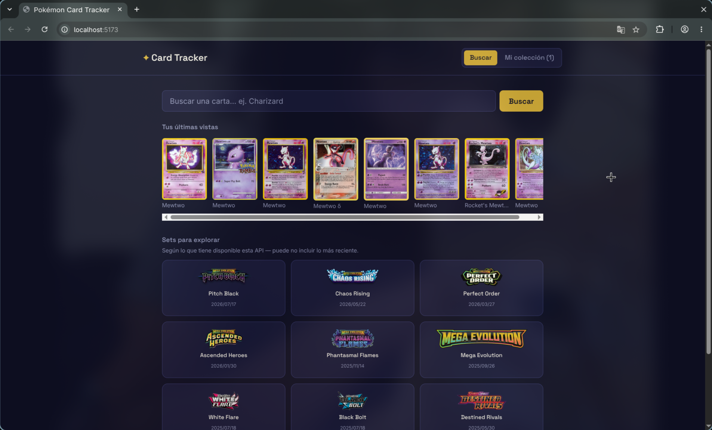

# Pokémon Card Tracker

Tracker de cartas Pokémon TCG: busca cartas, revisa su precio actual y su
historial, y lleva registro de tu colección personal con cuánto pagaste
vs. cuánto valen ahora.

Proyecto de práctica, construido con el mismo enfoque que
[finance-dashboard](../finance-dashboard): SQL puro (sin ORM) y un flujo
full-stack completo, esta vez integrando una API externa real.

## Screenshots



## Cómo funciona

1. Buscas una carta por nombre (ej. "Charizard").
2. El backend consulta la [API de pokemontcg.io](https://pokemontcg.io/)
   y guarda un snapshot del precio actual con la fecha de hoy.
3. Cada vez que vuelves a consultar esa carta (en días distintos), se
   guarda un snapshot nuevo — así se va armando un historial de precio
   real con el tiempo.
4. Puedes agregar cartas a tu colección personal, con cantidad, condición
   y cuánto pagaste, y el dashboard calcula la ganancia/pérdida contra el
   precio actual.

## Stack

**Backend:** FastAPI, SQLite (SQL puro vía `sqlite3`, sin ORM), `requests`
**Frontend:** React + Vite, Tailwind CSS, Recharts

## Decisiones de diseño

- **Caché local de cartas y sets**: antes de pegarle a la API externa, se
  revisa si ya existe en la base de datos local. Acelera búsquedas
  repetidas y reduce el consumo de la cuota diaria de la API.
- **Historial de precios propio**: la API externa solo da el precio
  *actual*; el historial de tendencia lo construye esta app guardando un
  snapshot por carta cada vez que se consulta.
- **Reintentos automáticos**: la API de pokemontcg.io está deprecada
  (dejó de aceptar cuentas nuevas) y sin API key es algo inestable, así
  que cada consulta reintenta hasta 3 veces antes de fallar.
- **`PokemonAPIError`**: excepción personalizada para diferenciar errores
  de la API externa (503, con mensaje claro) de errores internos reales.

## Cómo correrlo

```bash
# Terminal 1 — backend
cd backend
pip install -r requirements.txt --break-system-packages
python3 -c "import sqlite3; c = sqlite3.connect('data/pokemon.db'); c.executescript(open('app/db/schema.sql').read()); c.close()"
python3 -m uvicorn app.main:app --reload

# Terminal 2 — frontend
cd frontend
npm install
npm run dev
```

Abre `http://localhost:5173`.

**Opcional:** esta API ya no acepta registros de API key nuevos (está
deprecada), así que el proyecto funciona sin key, con límites de uso más
bajos. Si tienes una key existente, ponla en `backend/.env`:
```
POKEMONTCG_API_KEY=tu_key
```

Instrucciones detalladas en
[`backend/README.md`](backend/README.md) y
[`frontend/README.md`](frontend/README.md).

## Limitaciones conocidas

- La API externa está deprecada y no incluye los sets más recientes.
- El historial de precios depende de que uses la app en días distintos —
  no hay datos históricos previos a la primera consulta de cada carta.

## Próximos pasos

- Gráfica de valor total de la colección a través del tiempo
- Filtros en la colección (por set, por condición)
- Alertas cuando una carta sube/baja de precio significativamente